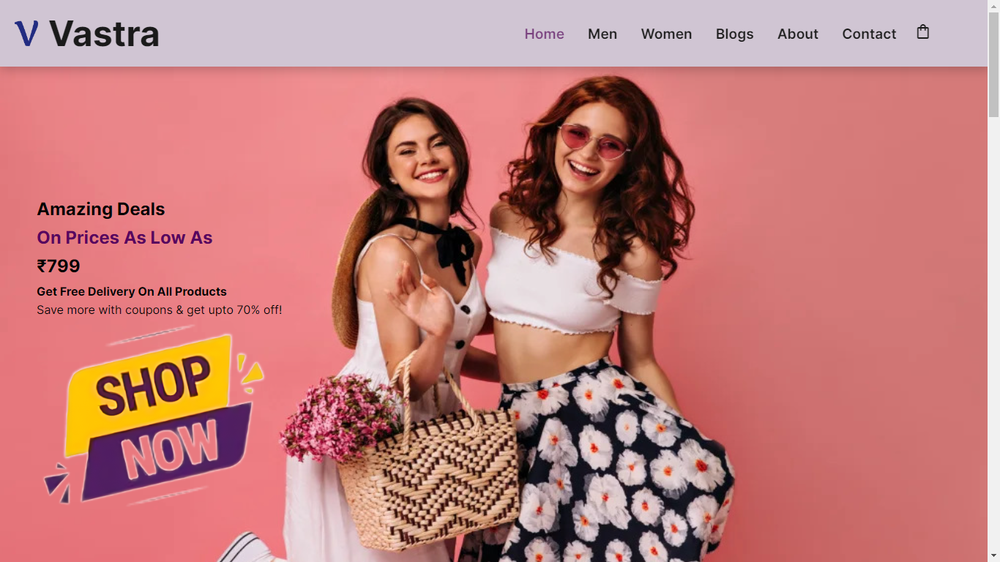
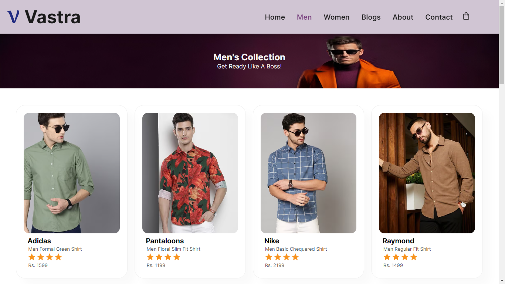
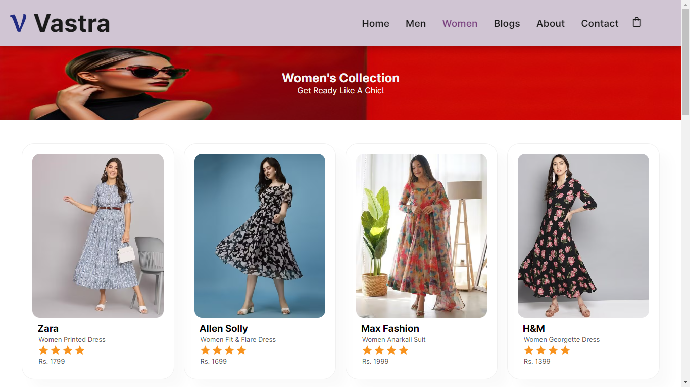
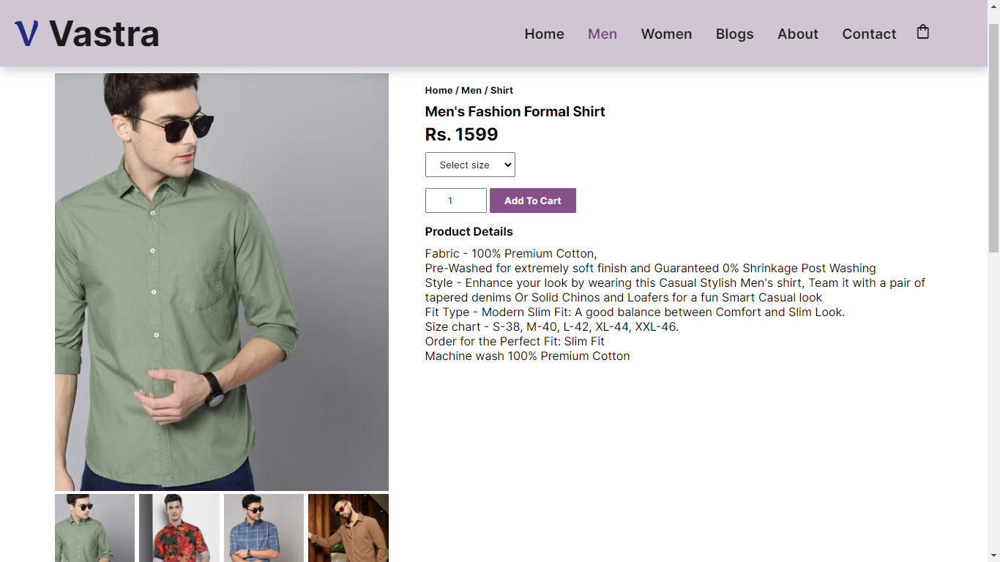
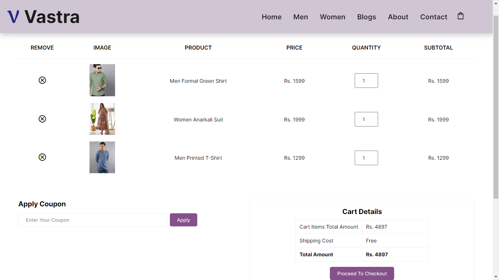

# Vastra - Clothing [](https://jyotiaggarwal2.github.io/vastra-clothing/)



## Table of Contents
- [Live Demo](#live-demo)
- [Introduction](#introduction)
- [Features](#features)
- [Screenshots](#screenshots)
- [Technologies Used](#technologies-used)
- [Setup](#setup)
- [Usage](#usage)
- [Contact](#contact)
- [Acknowledgements](#acknowledgements)
- [License](#license)

## Live Demo

Check out the live website [here](https://jyotiaggarwal2.github.io/vastra-clothing/).

## Introduction

Welcome to Vastra - Clothing, an innovative e-commerce platform designed to provide a seamless and enjoyable online shopping experience. Crafted with precision using HTML, CSS, and JavaScript, Vastra brings a wide array of fashionable clothing items to your fingertips. Our website is designed to be user-friendly and highly responsive, ensuring that users can browse and purchase clothing items with ease, regardless of the device they are using.

Vastra is more than just an online store; it's a complete shopping experience that combines aesthetic design, functionality, and performance. Our goal is to offer a smooth and intuitive interface that enhances the overall shopping experience for our customers.

## Features

- **Dynamic Product Listings**: Showcases a variety of men's and women's clothing items, allowing users to explore new arrivals and featured products.

- **Intuitive Cart Management**: Allows users to add, remove, or update item quantities in the shopping cart, with a clear summary of the total cost and items.

- **Detailed Product Pages**: Provides detailed information for each product, including images, price, description, brand, category, available sizes, and customer reviews.

- **Blog and Fashion Tips Section**: Offers a dedicated section for fashion articles, style guides, and tips, enhancing user engagement and positioning the brand as a fashion authority.

## Screenshots

### Home Page


### Men's Section


### Women's Section


### Product Page


### Blogs Page


### Shopping Cart


## Technologies Used

- **HTML**
- **CSS**
- **JavaScript**

## Setup

Follow these instructions to set up the project on your local machine.

### Prerequisites

- A modern web browser (e.g., Chrome, Firefox, Edge)

### Installation

1. Clone the repository:
    ```sh
    git clone https://github.com/JyotiAggarwal2/vastra-clothing.git
    ```

2. Navigate to the project directory:
    ```sh
    cd vastra-clothing
    ```

3. Open `index.html` in your web browser to view the website.

## Usage

- **Effortless Shopping Experience**: Browse and shop from a wide variety of men’s and women’s fashion items with a streamlined, user-friendly interface.

- **Explore Latest Trends**: Stay up-to-date with the latest styles by exploring the featured products and new arrivals sections.

- **Category-Specific Browsing**: Quickly find apparel by navigating directly to the men’s or women’s section for a more focused shopping experience.

- **Detailed Product View**: Click on a product to see more details, including sizes, colors, price, and available stock.

- **Add to Cart & Manage Selections**: Seamlessly add items to your cart and adjust quantities as needed, allowing for a smooth transition from browsing to checkout.

- **Personalized Shopping Lists**: Use the cart to temporarily save items you’re considering, enabling an organized and convenient decision-making process.

- **Responsive Viewing Across Devices**: Enjoy a consistent browsing experience on any device, whether on mobile, tablet, or desktop.

- **Discover Fashion Insights on the Blog**: Visit the blog section to read articles about fashion trends, styling tips, and more.


## Contact

- **GitHub:** [JyotiAggarwal2](https://github.com/JyotiAggarwal2)

## Acknowledgements

- Thanks to all contributors and users for their support.

## License

This project is licensed under the MIT License - see the [LICENSE](LICENSE) file for details.